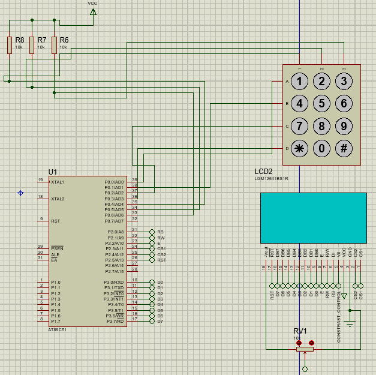
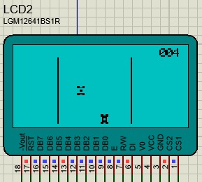

# stock_car_game
Implementação do Stock Car Game em C, no contexto da disciplina de Sistemas Embarcados (Engenharia de Computação - UFSCar - 2025/1), simulada no Proteus, ferramenta para visualização e simulação de sistemas embarcados microcontrolados.

## :video_game: Características Principais

- Execução 100% simulada (Proteus);
- Controle do carro preto pelas teclas **4** e **6** do teclado matricial;
- Elementos gráficos desenhados como **bitmaps**;
- Placar e sistema de pontuação;
- Desviar das colisões com a pista e os obstáculos e maximizar a pontuação.
## :floppy_disk: Arquivos Importantes do Projeto

- `main.c` — Código-fonte principal do jogo.
- `font_header.h` — Definições fontes utilizadas para mostrar placar.
- `stock_car.hex` — Arquivo .hex a ser inserido no AT89C51 no Proteus.

## :gear: Requisitos

- IDE **Keil uVision** (ou outra semelhante para microcontroladores);
- Software **Proteus**.
- Uso das teclas **4** (esquerda) e **6** (direita) na execução simulada do jogo.

## :tv: Mídias

- 📷 Imagens do jogo em execução:

<p align="center">
  
  
</p>

- 🎥 [Vídeo de demonstração no Google Drive](https://drive.google.com/file/d/1NkgYkkuGQF219L9WAwvwzaGD4ysoCQrC/view)

## :rocket: Execução

1. Compile e carregue o projeto pela IDE **Keil uVision**;
2. Na prórpia IDE, gere um arquivo .hex do projeto;
3. Utilize esse arquivo como entrada para o microcontrolador AT89C51 no **Proteus**;
4. Execute a simulação - para iniciar, pressionar "4" (tempo aleatório de press);
5. Através das teclas "4" e "6" (esquerda e direita, respectivamente), movimente o carro preto;
6. Evite colidir com os obstáculos e com a pista, maximizando sua pontuação.

## :computer: Exemplo de Código

### Bitmaps no Código

Os **bitmaps necessários para o funcionamento do jogo** (carro principal, carro obstáculo, por exemplo) estão definidos diretamente no arquivo `main.c` como **vetores 5x7 em hexadecimal** do tipo `char`.

A seguir, **exemplo** do bitmap do carro principal:

```
char car_bitmap[6] = {0xC3, 0xFF, 0x66, 0x66, 0xFF, 0xC3};
```

Visualmente, o car_bitmap matricial tem essa forma binarizada:

```
char car_bitmap_bin[6][8] = {
    {1, 1, 0, 0, 0, 0, 1, 1},  // 0xC3
    {1, 1, 1, 1, 1, 1, 1, 1},  // 0xFF
    {0, 1, 1, 0, 0, 1, 1, 0},  // 0x66
    {0, 1, 1, 0, 0, 1, 1, 0},  // 0x66
    {1, 1, 1, 1, 1, 1, 1, 1},  // 0xFF
    {1, 1, 0, 0, 0, 0, 1, 1}   // 0xC3
};
```

Cada valor `1` representa um pixel preenchido, enquanto `0` indica transparência.

Você pode replicar esse padrão para definir todos os demais bitmaps.

## :busts_in_silhouette: Créditos

- João Vitor Ribeiro de Oliveira (813109)
- Davi Cerchiari Alves (813985)

**Professor:** Emerson Carlos Pedrino  
**Universidade Federal de São Carlos (UFSCar)** — Departamento de Computação

## :page_facing_up: Licença

Projeto desenvolvido exclusivamente para fins acadêmicos.
